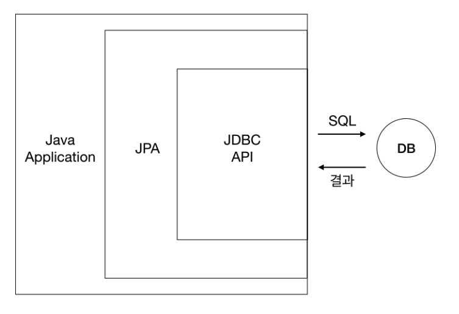
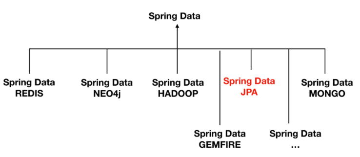
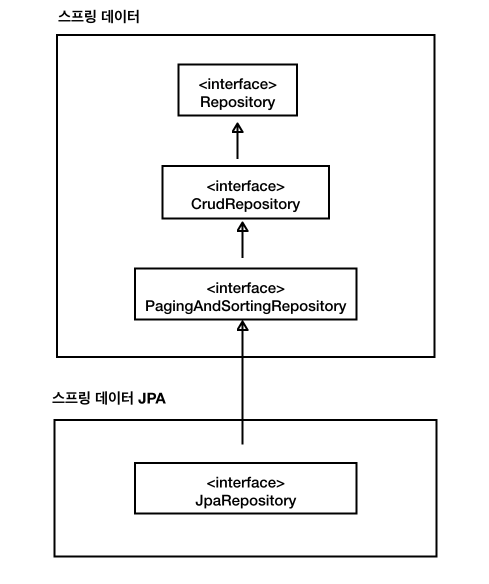

## 패러다임의 불일치 : 객체 vs 관계형 데이터베이스 

- 지향하는 목적이 서로 다름
- 객체 구조를 테이블 구조에 저장하는데 한계
- 패러다임의 불일치 문제를 개발자가 중간에서 해결하기에, 많은 시간과 코드 소비
  - 상속
  - 연관관계 (참조 / 외래키)
  - 비교 (동일성, 동등성 / 기본키)

## JDBC 를 직접 사용

SQL에 의존적인 개발

```java
try(Connection connection = DriverManager.getConnection(url, username, password)){
    
    String sql = "INSERT INTO ACCOUNT VALUES('jko', 'junhee.ko@gmail.com');";
    
    try(PreparedStatement statement = connection.prepareStatement(sql)){
        statement.execute();
    }
}
```

## JPA (Java Persistence API)

- Java 진영의 ORM 기술 표준

- 인터페이스를 모아둔 것

- ORM (Object-Relational Mapping)

  - 객체와 관계형 데이터베이스를 매핑

  

## Persistence Context

Entity Manager 로 엔티티 를 저장하거나 조회하면, Persistence Context 에 엔티티를 보관하고 관리

- 엔티티를 식별자로 구분
- Flush
  - 트렌젝션 커밋 순간 영속성 컨텍스트에 새로 저장된 엔티티를 DB에 반영
    - flush 방법
      - em.flush() 직접 호출
      - 트렌젝션 커밋시 자동호출
      - JPQL 실행시 자동호출
- 1차 캐쉬
  - 1차 캐쉬에 엔티티가 없으면 DB 조회 (식별자 값으로 조회)
- 쓰기 지연
  - 쓰기 지연 SQL 저장소에 INSERT SQL 을 모아두고, 트렌젝션 커밋 때 한번에 DB 에 보냄
- 변경 감지
  - flush 시점에 스냅샷(영속성 컨텍스트에 보관할 때 최초 상태) 과 엔티티 비교해서 변경된 엔티티를 찾음

## Entity 생명주기

- 비영속
- 영속
- 준영속
- 삭제

## Spring Data JPA

Spring Data JPA 는 JPA 에 특화된 기능 제공



### JpaRepository 계층구조


